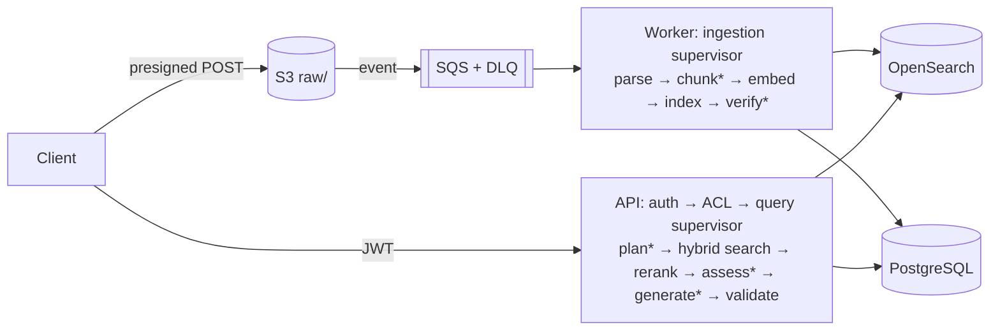

# Production Agentic Flow RAG AWS (Lean Agentic RAG)

A production-minded retrieval-augmented generation service on AWS with **two flows**
(ingestion and query), **deterministic supervisors**, and **four bounded LLM agents**:

| Agent                 | Flow      | Decides                                                       |
| --------------------- | --------- | ------------------------------------------------------------- |
| Chunking & Enrichment | ingestion | chunking strategy and size, title, keywords                   |
| Index Verifier        | ingestion | probe queries; re-chunk vs human review                       |
| Retrieval             | query     | route, query rewrites, which passages are sufficient evidence |
| Generator             | query     | the cited answer, or "insufficient evidence"                  |

Agents make decisions; code performs every action. Authorization is enforced in code before
retrieval, the generator sees only the selected evidence, every answer sentence is validated
against its citations, and the system abstains when evidence is missing.



<sub>\* = agent decision</sub>

More: [architecture](docs/architecture.md) · [ingestion flow](docs/ingestion-flow.md) ·
[query flow](docs/query-flow.md) · [AWS infrastructure](docs/aws-infrastructure.md) ·
[security](docs/security.md) · [deployment](docs/deployment.md) ·
[operations](docs/operations.md) · [evaluation](docs/evaluation.md) ·
[troubleshooting](docs/troubleshooting.md) · [design decisions](docs/design-decisions.md)

## Quick start (no AWS account needed)

Requires Python 3.12.

```bash
make install   # .venv + dependencies; creates .env with random local secrets
make test      # unit, integration and end-to-end tests
make eval      # offline evaluation with quality gates
make run       # API + embedded worker on http://localhost:8000 (OpenAPI at /docs)
make demo      # in another shell: upload a document, wait for INDEXED, ask a question
```

`make run` uses local backends: SQLite for state, the filesystem for objects, an SQLite
queue with SQS semantics (visibility timeout, receive count, DLQ), an in-memory BM25 + cosine
index, deterministic local models (feature-hashing embeddings, lexical reranker, heuristic
agent policies, extractive generator), and HS256 dev tokens (`make token SUB=alice TENANT=acme
USER_GROUPS=staff`). These are real implementations for development; production refuses to start
with any of them.

### Docker stack with the production adapters

```bash
make docker-up    # PostgreSQL, OpenSearch, LocalStack (S3 + SQS), API, worker
make demo         # same demo, now via S3 presigned POST -> S3 event -> SQS -> worker -> OpenSearch
make docker-down
```

Models and auth remain local in this stack (Bedrock and Cognito are not emulated). Export AWS
credentials and set `RAG_MODELS=bedrock` in `.env` to use real Bedrock models from it.

## What needs AWS credentials

|                                                          | Local             | Docker stack                | AWS |
| -------------------------------------------------------- | ----------------- | --------------------------- | --- |
| Tests, lint, typecheck, `make eval`                      | ✅                | —                           | —   |
| S3, SQS, PostgreSQL, OpenSearch adapters                 | local equivalents | ✅ (LocalStack, containers) | ✅  |
| Bedrock agents, embeddings, rerank (`make eval-bedrock`) | ❌                | with credentials            | ✅  |
| Textract OCR for scanned PDFs                            | ❌                | ❌                          | ✅  |
| Cognito authentication                                   | dev tokens        | dev tokens                  | ✅  |

## Deploy to AWS

```bash
cd infra && cp terraform.tfvars.example terraform.tfvars   # edit region, certificate, CIDRs
terraform init && terraform apply -target=aws_ecr_repository.app && cd ..
make deploy TAG=v1        # build + push image, terraform apply, wait for ECS
```

Prerequisites (Bedrock model access, OpenSearch service-linked role), creating Cognito users,
configuration and teardown (`make tf-destroy`) are in [docs/deployment.md](docs/deployment.md).
The infrastructure is ECS Fargate (API + worker from one image), ALB, RDS PostgreSQL,
OpenSearch, S3, SQS + DLQ, Cognito, KMS, CloudWatch alarms and dashboard — all in Terraform
under `infra/`.

## Configuration

Environment variables with the `RAG_` prefix (see `.env.example` and
`src/lean_rag/config.py`). Every loop and cost driver is bounded by `RAG_LIMITS__*`:
LLM calls and tokens per query/ingestion, retries, ingestion steps, search rounds, query
rewrites, retrieval candidates, evidence chunks, generation attempts, embedding batch size,
upload size, OCR timeout and SQS receive count.

## Testing

```bash
make test        # all tests: no network, no AWS
make lint        # ruff
make typecheck   # mypy --strict on src/
make check       # lint + typecheck + test + eval (what CI runs)
```

- **Unit** — every legal and illegal state transition, chunking, parsing decisions (incl.
  Textract path), ACL logic and OpenSearch query filters, JWT verification (local + Cognito
  RS256), retries/budgets, citation validation, prompt construction and fencing, agent
  output validation/fallbacks, config guards, and the AWS adapters against moto (S3, SQS)
  and botocore Stubber (Bedrock Converse, Titan, Rerank).
- **Integration** — ingestion (PDF/HTML/Markdown, duplicates, versions, stale chunks,
  throttling, DLQ, resume after crash, bounded re-chunk → `NEEDS_REVIEW`, budget), query
  (answers, abstention, cross-user and cross-tenant isolation, regeneration, invalid model
  output, throttling, injection), reindex/promote/rollback.
- **End-to-end** — over HTTP: create → upload → ingest → index → query → cited answer, plus
  ACLs, auth failures, versions, delete and reprocess.

## Evaluation

`make eval` ingests `evals/corpus/` through the real worker path and scores the agentic
pipeline against a naive RAG baseline: recall@5, MRR, answer correctness, groundedness,
citation validity, abstention accuracy, ACL leaks, prompt-injection resistance, latency,
tokens and estimated cost. Thresholds live in `evals/thresholds.json`. See
[docs/evaluation.md](docs/evaluation.md) for definitions, how to add cases, and an honest
reading of the offline results.

## Project structure

```
src/lean_rag/      application package (api, agents, supervisors, ingestion, retrieval,
                   llm, security, storage, observability, evaluation, domain)
tests/             unit / integration / e2e
evals/             corpus, cases.jsonl, thresholds.json
infra/             Terraform for the whole AWS stack
scripts/           deploy, demo, dev tokens, DLQ redrive, LocalStack init
docs/              architecture and operations documentation
.github/workflows/ CI: lint, typecheck, tests, eval, docker build, terraform validate, scans
```

## Verification status

Verified in the environment this repository was built in: `make test` (all tests pass),
`make lint`, `make typecheck` (mypy strict), `make eval` (thresholds pass offline), and a
local end-to-end run (`make run` + `scripts/demo.py`, plus the reindex CLI). Terraform files
parse and are `fmt`-clean.

Not executed there, because container registries and the Terraform provider registry were
not reachable: `docker build`, `make docker-up`, `terraform validate/plan/apply`, and any call
to real AWS services (Bedrock is covered by stubbed adapter tests and a scripted client for
the LLM agent paths). CI runs `docker build` and `terraform validate`; run `make eval-bedrock`
and a dev deployment before relying on the AWS path.

## License

MIT
