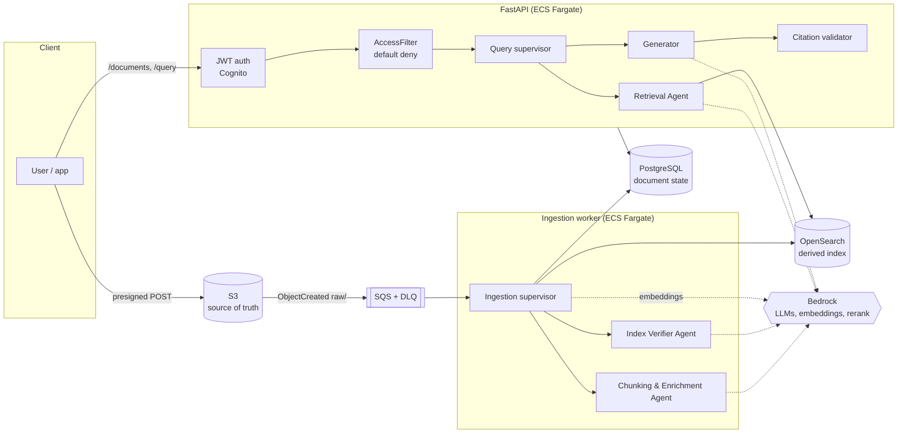

# Architecture

A production style agentic flow rag service: two flows (ingestion and query), each driven by a
**deterministic supervisor** (a state machine in code) that consults **four bounded LLM
agents** for judgment and performs every action itself.



## Principles and where they live in the code

| Principle | Implementation |
|---|---|
| Agents decide, code acts | Agents return small Pydantic models (`extra="forbid"`). Supervisors (`supervisors/`) do all I/O. Agents have no tools. |
| Supervisors are state machines | `domain/state_machine.py` (ingestion lifecycle), `supervisors/query.py` (fixed pipeline with bounded loops). |
| LLMs only where judgment helps | Chunk plan + enrichment, probe writing + re-chunk recommendation, query planning + evidence selection, answer writing. Parsing, hashing, ACLs, fusion, validation, retries are code. |
| S3 is the source of truth | Raw uploads under `raw/`, stage outputs under `derived/`. OpenSearch is rebuilt from S3 by `lean-rag-reindex`. |
| Everything bounded | `config.Limits`: LLM calls, tokens, retries, steps, search rounds, rewrites, candidates, evidence, generation attempts, OCR timeout, SQS receive count. |
| Authorization in code | `security/acl.py` builds an immutable `AccessFilter` from the verified token before retrieval; every index read requires it; results are re-checked. |
| Generator sees only evidence | `agents/generator.py` receives the question and the selected passages, nothing else. |
| Abstain without evidence | Out-of-scope route, insufficient evidence, failed validation (after one regeneration) and exhausted budgets all abstain. |
| Simplicity | One image, two processes; four agents; no agent framework; one IaC tool. |

## Agents

| Agent | Decides | Bounded by | Fallback on invalid output |
|---|---|---|---|
| Chunking & Enrichment | strategy (heading/paragraph/fixed), size, overlap, title, keywords | sizes clamped in code; 1 call per chunking pass | heuristic plan from document structure |
| Index Verifier | probe queries for sampled chunks; re-chunk vs review | re-chunk at most `max_rechunk_attempts`; code computes pass rate | keyword probes; rechunk if allowed |
| Retrieval | route (search / out of scope), up to 3 query rewrites, evidence selection, one follow-up query | `max_search_rounds`, `max_rewritten_queries`, `max_evidence_chunks`; original question always searched | keyword query; coverage-based selection |
| Generator | answer sentences with citations, or insufficient evidence | `generation_attempts` (1 + 1 regeneration) | treated as a failed attempt |

Each agent has an LLM policy (Bedrock, used when `RAG_MODELS=bedrock`) and a deterministic
heuristic policy. The heuristic policy runs offline/locally, is the fallback for invalid
model output, and is the comparison baseline in evaluation.

## Code map

```
src/lean_rag/
  api/            FastAPI app and request/response schemas
  agents/         four agents, prompts (fencing, canary), citation validation
  supervisors/    ingestion state machine driver, query pipeline
  ingestion/      validation + parsing (PDF/HTML/Markdown/text, Textract OCR), chunking
  retrieval/      index port (OpenSearch + in-memory), hybrid search with RRF, rerank
  llm/            model ports, ModelGateway (budget, retries, cost, schema validation), Bedrock + local models
  security/       JWT auth (Cognito/local), ACL, prompt-injection helpers
  storage/        S3/local objects, SQS/local queue, PostgreSQL/SQLite repository
  observability/  JSON logging with correlation ids, CloudWatch EMF metrics
  evaluation/     eval runner and naive baseline
  domain/         models and state machine
  worker.py       SQS consumer
  reindex.py      versioned index build / promote / rollback
  container.py    composition root (the only place that chooses backends)
  config.py       settings and limits
```

See [design-decisions.md](design-decisions.md) for the trade-offs behind these choices.
