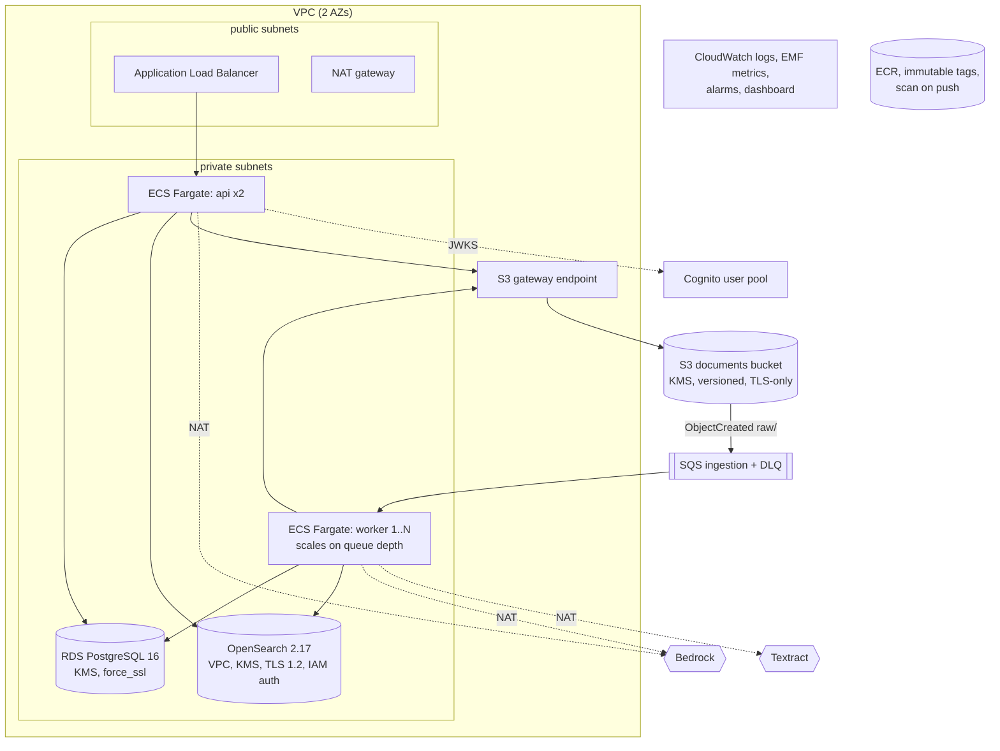

# AWS infrastructure

Everything is defined in Terraform under `infra/` (one IaC tool, no modules from the
registry, ~10 files you can read top to bottom).

## Resources

| File | Contents |
|---|---|
| `versions.tf` | providers, optional S3 remote state, shared locals |
| `network.tf` | VPC, 2 public + 2 private subnets, 1 NAT gateway, S3 gateway endpoint, security groups (ALB → API:8000; tasks → RDS:5432, OpenSearch:443; tasks egress 443) |
| `storage.tf` | KMS key, documents bucket (versioning, SSE-KMS, public access block, TLS-only policy, lifecycle, optional CORS), SQS queue + DLQ + redrive, S3 → SQS notification for `raw/` |
| `data.tf` | RDS PostgreSQL (managed master password in Secrets Manager, encrypted, private), OpenSearch domain (VPC, encrypted, IAM access policy limited to the two task roles) |
| `auth.tf` | Cognito user pool (admin-created users, immutable `custom:tenant_id` not writable by users), app client, `admin` group |
| `iam.tf` | ECS execution role (pull, logs, DB secret), API task role, worker task role |
| `compute.tf` | ECR, ECS cluster, task definitions, ALB + listeners, services, worker autoscaling |
| `monitoring.tf` | SNS alarm topic, alarms, dashboard |
| `outputs.tf` | URLs and names used by `scripts/deploy.sh` and operators |

## Why ECS Fargate and not Lambda / Step Functions

- The worker's unit of work (parse → OCR wait → embed → index → verify) can take minutes
  and benefits from in-process retries and connection reuse; Lambda's 15-minute cap and
  cold starts add edge cases for no gain.
- One container image runs both the API and the worker, so local, CI and AWS behave
  the same.
- The workflow state machine is small and lives in PostgreSQL; Step Functions would split it
  between two places. See [design-decisions.md](design-decisions.md).

## Networking assumptions

- Tasks run in private subnets with no public IPs. AWS APIs (Bedrock, SQS, Textract,
  Cognito JWKS, ECR) are reached via the NAT gateway; S3 via the free gateway endpoint.
  For stricter egress, add interface endpoints (Bedrock runtime, SQS, ECR, logs, STS) and
  remove the NAT route — this costs per endpoint per AZ.
- One NAT gateway is a single-AZ dependency. Add one per AZ for production availability.
- The OpenSearch domain is single-node by default (`opensearch_instance_count = 1`). Use
  ≥ 2 (zone awareness is enabled automatically) for production.

## Estimated cost areas

Rough on-demand magnitudes for the default sizing; check the AWS Pricing Calculator for
your region before relying on them.

| Area | Default | Driver |
|---|---|---|
| NAT gateway | 1 | hourly + per-GB processed (largest fixed cost) |
| ALB | 1 | hourly + LCUs |
| ECS Fargate (ARM64) | api 2×0.5 vCPU/1 GB, worker 1–4×1 vCPU/2 GB | vCPU and memory hours |
| RDS PostgreSQL | db.t4g.micro, 20 GB gp3, single-AZ | instance hours, storage, backups |
| OpenSearch | 1× t3.small.search, 20 GB gp3 | instance hours, storage |
| Bedrock | per request | input/output tokens; embeddings per token; rerank per query |
| Textract | per page | only for scanned PDFs |
| CloudWatch | logs 30 days, EMF metrics, 6 alarms, 1 dashboard | ingestion GB, custom metrics |
| KMS, Secrets Manager, SQS, S3, Cognito | small | per key/secret/request/GB/MAU |

Model costs are estimated per query (`estimated_cost_usd`) from `RAG_MODEL_PRICES_PER_1K`;
set those prices from the current Bedrock price list.
