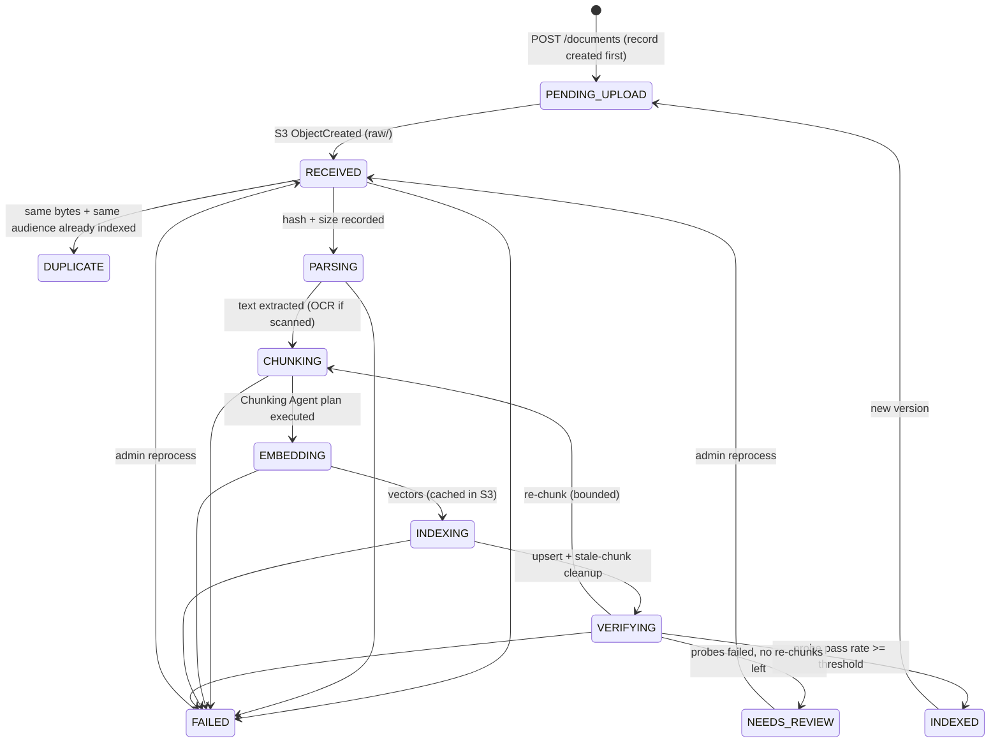

# Ingestion flow

The full transition table (including DELETED and new-version edges) is
`TRANSITIONS` in `src/lean_rag/domain/state_machine.py`; `tests/unit/test_state_machine.py`
asserts every legal edge is accepted and every one of the remaining state pairs is rejected.

## Steps

1. **Create** — `POST /documents` validates the filename/type and ACL grants, writes the
   `documents` row (`PENDING_UPLOAD`) and returns a presigned S3 POST restricted to the
   exact key, content type and size (`content-length-range`).
2. **Upload** — the client posts directly to S3 under
   `raw/{tenant}/{document_id}/v{version}/{filename}`. S3 sends an `ObjectCreated` event
   (filtered to `raw/`) to SQS.
3. **Receive** — the worker parses the event, takes a lease on the document, and moves it
   to `RECEIVED`. Events for unknown documents or old versions are dropped.
4. **RECEIVED** — computes SHA-256. If another document in the tenant with identical bytes
   *and the same audience* is `INDEXED`, the document becomes `DUPLICATE`. Identical bytes
   shared with a different audience are indexed so ACLs stay exact.
5. **PARSING** — deterministic rules by extension + magic bytes: PDF via `pypdf`; PDFs with
   < 25 chars/page are treated as scanned and sent to Textract (async, bounded polling);
   HTML keeps visible text and headings and drops scripts, styles and comments; Markdown and
   text are normalised. Output: `derived/.../parsed.json`.
6. **CHUNKING** — the Chunking & Enrichment Agent picks a plan; code clamps and executes it
   and builds chunks with deterministic ids `sha256(tenant|doc|version|chunker_version|ordinal)`,
   ACL principals, title, keywords and an `injection_suspect` flag. Output: `chunks-*.json`.
7. **EMBEDDING** — batched embeddings; vectors are cached in S3 by text hash, so retries
   and re-chunks only embed new text.
8. **INDEXING** — bulk upsert into the live alias (ids overwrite), then delete the
   document's chunks whose ids are not in the new set (previous versions, old re-chunks).
9. **VERIFYING** — code checks the index holds exactly the expected chunk ids, samples up
   to 5 chunks, asks the Verifier Agent for probe queries, and runs them through the real
   hybrid retrieval scoped to the document. A probe passes if its chunk ranks in the top
   third of the document (max top 5). Pass rate ≥ `verifier_min_pass_rate` → `INDEXED`.
   Otherwise the agent recommends re-chunk or review; code allows at most
   `max_rechunk_attempts` re-chunks, then `NEEDS_REVIEW`.

## Idempotency and failure handling

| Concern | Mechanism |
|---|---|
| Duplicate S3 events / SQS redelivery | Terminal documents are a no-op; compare-and-set transitions; deterministic chunk ids |
| Two workers, same document | Lease (`lease_owner`, `lease_expires_at`); the loser deletes its duplicate message |
| Crash mid-pipeline | State is persisted per step; stage output is in S3; redelivery resumes from the stored state (tested: an index outage does not re-parse, re-chunk or re-embed) |
| Throttling / timeouts | `with_retries`: capped exponential backoff with jitter, `max_retries` per call |
| Persistent transient failure | The message is left in SQS; after `max_receive_count` deliveries the document is marked `FAILED("retries exhausted")` and SQS moves the message to the DLQ |
| Malformed / unsupported input | `PermanentError` → `FAILED` immediately, message deleted, no retries |
| Runaway loops | `max_ingestion_steps` per attempt, LLM call + token budget per attempt |

`max_receive_count` in the app must equal the queue's redrive `maxReceiveCount`; Terraform
passes the same variable to both.
