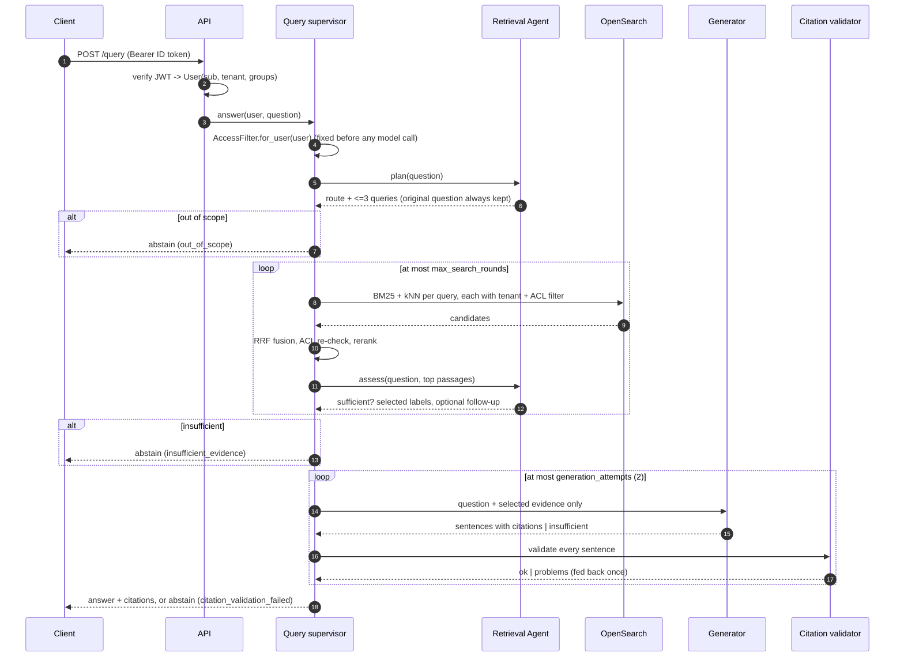

# Query flow

## Validation rules (deterministic, `agents/citations.py`)

Every sentence must:

- cite at least one evidence id, and only ids that were supplied;
- have ≥ 50 % of its content terms present in the cited passages;
- contain no number that is absent from the cited passages;
- not contain the system-prompt canary.

One failed attempt produces feedback for one regeneration. A second failure abstains.

## Abstention reasons

| Reason | When |
|---|---|
| `out_of_scope` | greetings, requests to perform actions, questions not answerable from documents |
| `insufficient_evidence` | nothing the user may read supports an answer (also returned when no index exists yet) |
| `citation_validation_failed` | two answers failed validation |
| `budget_exceeded` | per-query LLM call or token budget hit |

Abstention messages are identical whether a document does not exist or exists but is not
visible to the caller, so the API does not leak existence across ACLs.
